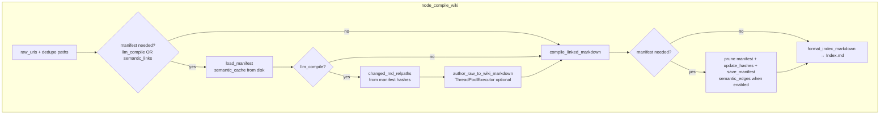
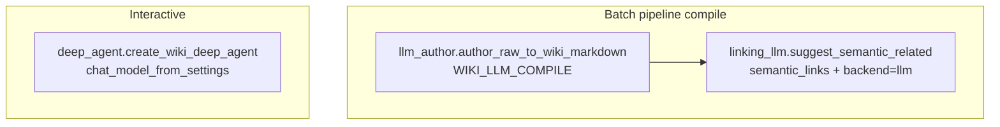

# wiki-langgraph architecture

Configuration flows through **`Settings`** (`wiki_langgraph.config`) from environment variables and `.env`. See `.env.example` for names.

---

## LangGraph pipeline (`wiki-langgraph run`)


| Node | Module | What happens |
|------|--------|----------------|
| **ingest** | `nodes.node_ingest` | Recursive file list under **raw** dir → `raw_uris` (skips `.gitkeep`, anything under `.git`). |
| **compile_wiki** | `nodes.node_compile_wiki` | See [Compile step](#compile-step-node_compile_wiki) below. Writes **`Index.md`** here. |
| **index** | `nodes.node_index` | Optional **QMD index refresh** only (`QMD` call #2 — see [QMD](#qmd-local-search--embeddings)). Default is effectively off unless `WIKI_QMD_REFRESH=true`. Does **not** write `Index.md`. |
| **lint** | `nodes.node_lint` | Runs the same checks as `wiki-langgraph lint` (`lint.run_lint`): unresolved wikilinks, orphan notes with no outgoing `[[wikilinks]]`, stale wiki output, and `Index.md` drift. If any issue is reported, sets `last_error` so **`wiki-langgraph run` exits 1**. Skipped when **`WIKI_LINT_ON_RUN=false`**. |

---

## When `WIKI_SEMANTIC_LINKS=true`

This section is the flow **only when semantic links are on**. Otherwise `compile_linked_markdown` skips Pass 1 semantic work and does not persist `semantic_edges`.

Semantic “See also” runs **inside** `compile_linked_markdown` (not a separate LangGraph node). **`node_compile_wiki`** loads the manifest first so **`semantic_cache`** (loaded from `semantic_edges`) can skip LLM/QMD calls when the stripped body hash matches.

```mermaid
flowchart TB
  START([WIKI_SEMANTIC_LINKS = true]) --> LM[load_manifest in node_compile_wiki<br/>semantic_cache ← semantic_edges]
  LM --> CL[compile_linked_markdown]

  subgraph p1["Pass 1 — each .md in catalog"]
    CL --> LOOP[For each rel]
    LOOP --> HASH[SHA256 stripped body]
    HASH --> CACHE{Cache hit?}
    CACHE -->|yes| REUSE[Use cached edges]
    CACHE -->|miss| BR{WIKI_SEMANTIC_BACKEND}
    BR -->|llm| API{WIKI_OPENAI_API_BASE?}
    API -->|yes| LLM[linking_llm.suggest_semantic_related]
    API -->|no| SK[Skip LLM semantic]
    BR -->|qmd| QMD[linking_qmd.suggest_related_via_qmd]
    LLM --> W[semantic_cache rel updated]
    QMD --> W
    REUSE --> AGG[all_semantic]
    SK --> AGG
    W --> AGG
  end

  subgraph p2["Graph + Pass 2"]
    AGG --> FWD[Forward graph = authored [[wikilinks]] only]
    FWD --> BE[Backlinks footer = inverse of forward explicit]
    AGG --> SI[semantic_incoming = reverse of all_semantic]
    BE --> MERGE[Pass 2 write: See also body + Backlinks + Related semantic + frontmatter]
    SI --> MERGE
    MERGE --> OUT[Write wiki files]
  end

  OUT --> SAVE[node_compile_wiki: save_manifest<br/>pruned hashes + pruned semantic_edges]
  SAVE --> IDX[format_index_markdown → Index.md]
```

| Setting | Effect |
|---------|--------|
| `WIKI_SEMANTIC_LINKS` | Enables Pass 1 + writes `semantic_edges` back into the manifest at end of compile. |
| `WIKI_SEMANTIC_BACKEND` | `llm` → `linking_llm.suggest_semantic_related`; `qmd` → `linking_qmd.suggest_related_via_qmd` (`qmd query`). |
| `WIKI_OPENAI_API_BASE` | Required for the **LLM** backend; if unset, the LLM branch is skipped (no semantic edges from LLM that run). |

`WIKI_LLM_COMPILE_MAX_WORKERS` does **not** apply here — it only limits **LLM authoring** (`author_raw_to_wiki_markdown`), not Pass 1 semantic calls.

### Provenance (authored links vs semantic)

Obsidian **backlinks** (in the usual sense) are **authored** `[[wikilinks]]`. Semantic similarity is a **recommendation** layer, not the same kind of edge.

| Output | Meaning |
|--------|---------|
| **See also** (body) | Outbound `[[wikilinks]]` injected from Pass 1 suggestions — navigable in Obsidian; still machine-suggested, not hand-written. |
| **Backlinks** (footer) | **Only** notes that contain an authored wikilink targeting this page (computed from explicit extraction only). |
| **Related (semantic)** (footer) | Notes whose suggested See also included **this** page — labeled as compile-time suggestions, distinct from Backlinks. |

Semantic edges are **not** folded into the same forward graph used for Backlinks, so the footer does not treat recommendations as authoritative authored graph edges.

---

## Compile step (`node_compile_wiki`)

Rough order (see `nodes.py` + `linking.py`):



| Subsystem | Where | Role |
|-----------|--------|------|
| **Manifest** | `manifest.py` | JSON at `resolved_manifest_path()` (default `data/.wiki-langgraph/manifest.json`): per-file content hashes for incremental **LLM compile**; **`semantic_edges`** cache (hash + list of related relpaths) when **semantic links** are on. Before save, deleted-note hash entries and semantic cache entries are pruned so stale relpaths do not accumulate. |
| **LLM authoring** | `llm_author.py` | Only if `WIKI_LLM_COMPILE=true`: rewrites selected raw `.md` → wiki-shaped markdown; injects `compiled_from:`; optional **enrich** from existing wiki. **Not** parallelized with semantic pass; `WIKI_LLM_COMPILE_MAX_WORKERS` only affects this step. |
| **Linking** | `linking.py` → `compile_linked_markdown` | Copy/process all files; **Pass 1** semantic suggestions; **explicit-only** forward graph for Backlinks; **Related (semantic)** footer for inbound suggestions; **Pass 2** write; **`frontmatter_graph`** merge (`wiki_langgraph_*`). |
| **Lint** | `lint.py` | **Batch:** `node_lint` after **index** (default). **Ad-hoc:** `wiki-langgraph lint` — same `run_lint` rules (unresolved wikilinks, `W_ORPHAN_NOTE`, `W_INDEX_DRIFT`, `W_STALE_WIKI`, `E_READ`, etc.). |

---

## QMD (local search / embeddings)

QMD appears in **two independent places**. Both are optional and gated by settings.

### 1) Semantic “See also” backend (`compile_linked_markdown`)

| Setting | Typical value |
|---------|----------------|
| `WIKI_SEMANTIC_LINKS` | `true` |
| `WIKI_SEMANTIC_BACKEND` | `qmd` (vs `llm`) |

| Module | Function |
|--------|----------|
| `linking_qmd.py` | `suggest_related_via_qmd` → runs **`qmd query … --json`** per note (with `qmd_top_n`, `qmd_min_score`, `qmd_query_timeout_sec`), maps `qmd://…` hits back to vault relpaths. |

Invoked from **`linking.py`** inside the **first pass** over markdown notes (same pass as LLM semantic when `semantic_backend=llm`). **Manifest semantic cache** skips `qmd query` when raw body hash unchanged.

**Parallelism:** Semantic work is **per-note inside `compile_linked_markdown`**; it is **not** controlled by `WIKI_LLM_COMPILE_MAX_WORKERS` (that setting only affects LLM authoring in `nodes.py`).

### 2) Index refresh (`graph` node **`index`**)

| Setting | Role |
|---------|------|
| `WIKI_QMD_REFRESH` | When `true`, after wiki files are written, run **`qmd update`** then **`qmd embed -c <collection>`** so the local QMD index/embeddings match the vault on disk. Default is **`false`** so a minimal run does not require QMD. |

| Module | Function |
|--------|----------|
| `linking_qmd.py` | `run_qmd_refresh` (subprocess; `qmd_refresh_timeout_sec`, optional `qmd_cpu_only` env for node-llama-cpp). |

Called only from **`node_index`** — **after** `compile_wiki` finishes, so new/changed wiki paths are on disk before embedding.

---

## LLM (OpenAI-compatible HTTP) — three call sites

All use **`langchain_openai.ChatOpenAI`** with `WIKI_OPENAI_API_BASE`, `WIKI_LLM_MODEL`, `WIKI_LLM_REQUEST_TIMEOUT_SEC`, etc.



| Call site | Module | When |
|-----------|--------|------|
| **Authoring** | `llm_author.py` | `WIKI_LLM_COMPILE`: raw → wiki markdown per changed file (incremental via manifest). |
| **Semantic links** | `linking_llm.py` | `WIKI_SEMANTIC_LINKS` and `WIKI_SEMANTIC_BACKEND=llm`: related-note suggestions in `compile_linked_markdown` pass 1. |
| **Deep agent** | `deep_agent.py` | User invokes agent; not part of `wiki run` unless you call it from code. |

**Obsidian OFM system text** for prompts: `obsidian_prompt.wiki_llm_system_instructions` / `load_obsidian_markdown_skill_text` (skill path: `WIKI_OBSIDIAN_MARKDOWN_SKILL_PATH` or project/bundled `skills/obsidian-markdown/SKILL.md`).

---

## `compile_linked_markdown` internals (`linking.py`)

1. Load all `.md` bodies (or **content_overrides** from LLM step).
2. **Pass 1 — semantic edges (if enabled):** for each `.md`, body hash vs **semantic_cache** → if miss, call **`suggest_semantic_related`** (LLM) or **`suggest_related_via_qmd`** (QMD).
3. Build **forward_explicit** from **`extract_wikilink_targets` only**; **backlinks_explicit** = inverse. Build **semantic_incoming** from `all_semantic` (reverse edges). Do **not** merge semantic stems into the forward graph used for Backlinks.
4. **Pass 2 — write:** strip managed blocks, merge **`wiki_langgraph_*`**, append **See also** + **Backlinks** (authored) + **Related (semantic)** (inbound suggestions), with dedupe so a neighbor is not listed twice on the same page when already in See also.
5. Return counts; caller prunes stale manifest entries, saves fresh hashes / semantic cache, and writes **Index.md**.

---

## CLI

| Command | Flow |
|---------|------|
| `wiki-langgraph run` | `graph.run_once` → ingest → compile_wiki → index → **lint** (unless `WIKI_LINT_ON_RUN=false`). On lint failure, stderr shows `last_error` + step log; exit **1**. |
| `wiki-langgraph lint` | `lint.run_lint` on raw + wiki only (no compile). Same rules as the **lint** graph node, including orphan-note warnings for notes with no outgoing `[[wikilinks]]`; optional `--strict` treats warnings as exit **1** when used standalone. |
| `wiki-langgraph lint --fix` | `lint.fix_unresolved_wikilinks`: rewrite broken `[[links]]` in **raw** `.md` (fuzzy catalog match, then strip to plain text unless `--fix-mode rewrite`). Use `--dry-run` first. |
| `wiki-langgraph version` | Package version string. |

**Exit behavior:** the graph **lint** node fails the run if **`run_lint`** returns **any** issue. The standalone **`lint`** command exits **0** when there are only warnings unless you pass **`--strict`** (then warnings also fail).

---

## Deep Agents (separate from batch compile)

| Piece | Role |
|-------|------|
| `deep_agent.create_wiki_deep_agent` | LangGraph Deep Agent with filesystem backend; **`/skills/`** routes to bundled `wiki_langgraph/skills` or project `skills/` when `skills/obsidian-markdown/SKILL.md` exists. |
| Not invoked by `wiki-langgraph run`. | |

---

## Quick reference: “where is X?”

| Concern | Primary location |
|---------|-------------------|
| Graph topology | `graph.py` |
| State + reducers | `state.py` |
| Ingest / compile / index / lint nodes | `nodes.py` |
| Wikilinks, backlinks, See also, frontmatter merge | `linking.py`, `frontmatter_graph.py` |
| QMD query + refresh | `linking_qmd.py` |
| LLM semantic suggestions | `linking_llm.py` |
| LLM raw→wiki authoring | `llm_author.py` |
| Incremental hashes + semantic cache | `manifest.py` |
| Env / validation | `config.py` |
| Vault lint rules | `lint.py` |
